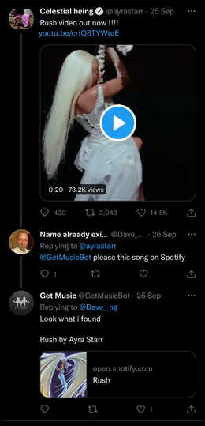
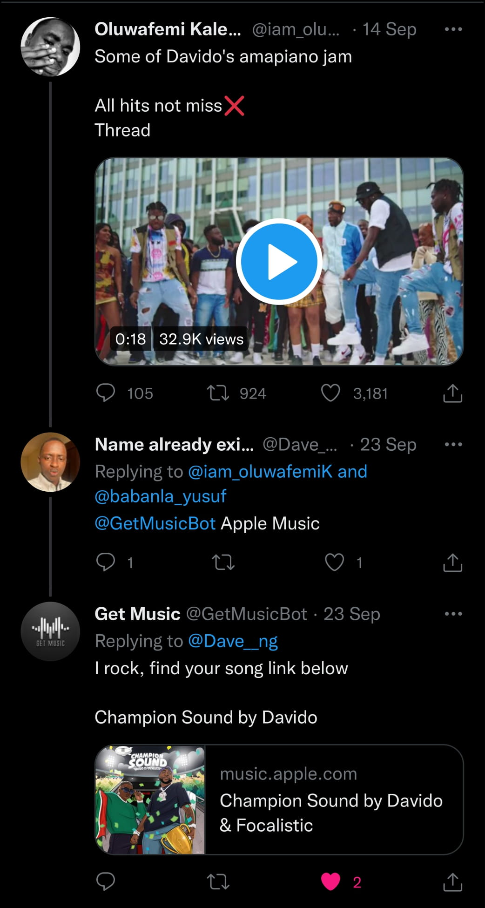

<h1 align="center">GET MUSIC TWITTER BOT</h1>

Find any music from a video on twitter

[alt text](Profile image.jpeg)

# Introduction
With the rise of internet and social media users today, twitter has made it possible for every of its user to post a video as a tweet irrespective of the kind, many of these are music videos or videos made with songs from artists.
If the tweet author doesn't specify the song name and artist of what is being played in the video anyone who sees the tweet and needs that information won't have access to it.

This is where this bot [Getmusicbot](https://twitter.com/GetMusicBot?s=20&t=zvJjEkuU03HNAxpCjpFEOg) would come in handy.

# What you'd need
1. Python
2. Twitter developer account with [elevated access](https://developer.twitter.com/en/portal/petition/essential/basic-info)
3. AWS services ([Lambda](https://aws.amazon.com/lambda/), [S3](https://aws.amazon.com/s3/), [EFS](https://aws.amazon.com/efs/) and [Eventbridge](https://aws.amazon.com/eventbridge/))
4. [Audd.io](https://dashboard.audd.io/) account

<b>Note: </b>You may not need services mentioned in number 2 above if you are just testing this out. Those services are used for hosting the entire project live so users can interact with the bot real time. For more info <a href="mailto:davidodenikpi@gmail.com">reachout</a>

# How this works
1. When this bot is mentioned it checks that the following rules are met before any steps are carried out:
* It is a reply to a tweet and not an origin tweet
* The tweet it is being tagged to contains a media and that media type is video

2. Once this has been established an <b>ETL</b> process will be initiated. It will filter through these two tweets data and extract information like:
* video url
* tweet text
* the user who mentioned the bot
* tweet id for an effective reply
Save unto a text file and upload to AWS EFS

3. It will then download the video using the url
4. Transform it into an audio file(.mp3)
5. Load this audio file into an s3 bucket
6. Generate a presigned url to access that audio file
7. Use the url to run on a recognition on the Audd.io algorithm
8. Reply tweet with link to song based on specified streaming platform by mentioned by user

<b>Note: </b> A user who tags this bot can also specify what streaming platform he wants the bot to reply with, e.g Spotify, Apple music. with or without quotes. If none is provided youtube will be returned.

# Results

